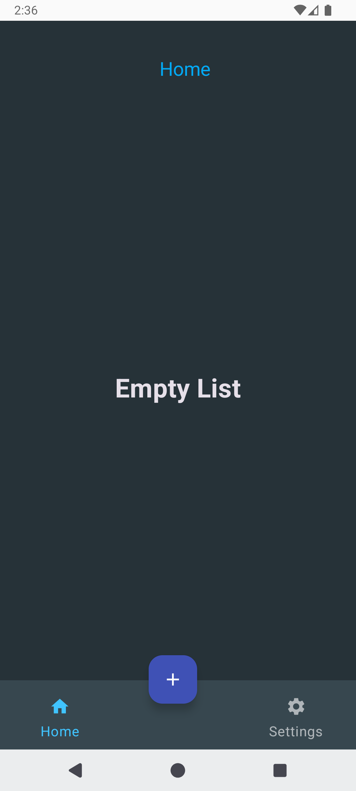
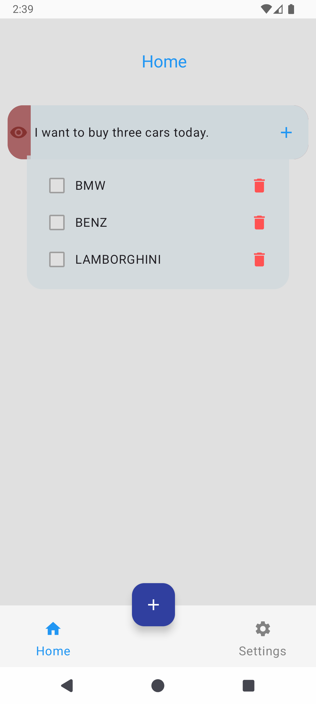
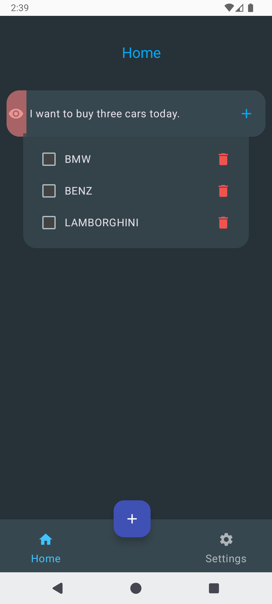
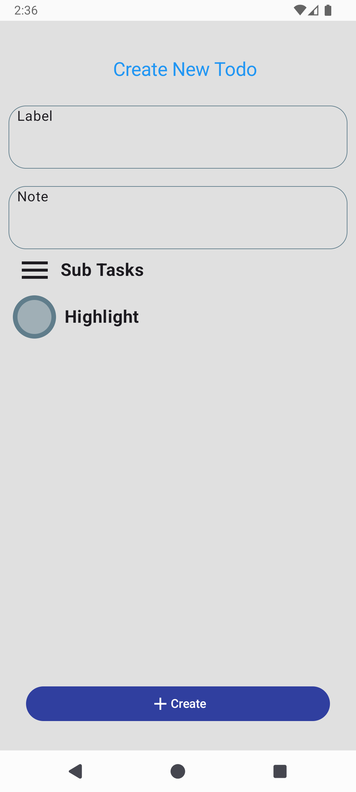
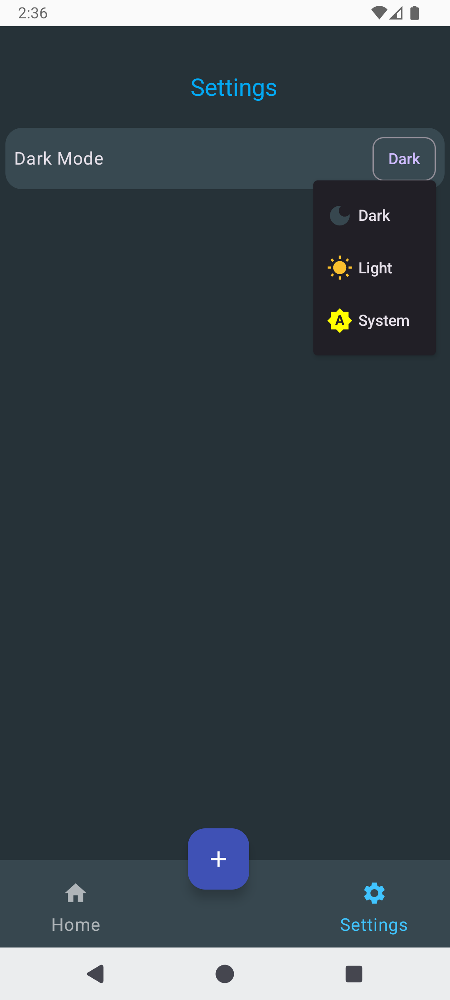

# TodoApp

TodoApp is a simple application for managing daily tasks, developed using modern Android technologies.

## Screenshots

### Home Screen
<div style="display: flex; flex-wrap: wrap; gap: 15px; justify-content: center;">

  
  
  

</div>

### Create Screen
<div style="display: flex; justify-content: center; gap: 15px;">

  

</div>

### Settings Screen
<div style="display: flex; justify-content: center; gap: 15px;">

  

</div>


## Technology / Stack
- **Data persistence** with **Room Database**.
- State and data management using **ViewModel** and **Life Cycle Components**.
- Asynchronous operations with **Kotlin Coroutines**.
- Dependency injection with **Koin**.
- Lightweight data storage using **DataStore**.
- **Navigation** for seamless page transitions.

## Prerequisites
- **Android Studio Giraffe** or later.
- **JDK 25**.
- Minimum **Android SDK 24** (Android 5.0).

## How to Build
1. Clone the repository:
   ```bash
   git clone https://github.com/hosseinSh1379/TodoApp.git 


### Open the Project in Android Studio

1. Open Android Studio, and select **Open an existing project**.
2. Navigate to the cloned directory and open the project.

### Install Dependencies

- Android Studio will automatically download necessary dependencies (such as Gradle and other libraries). Wait for the sync process to finish.

### Build the Project

- Once the project is synced, build the project by clicking the **Build** button in Android Studio or by selecting **Build > Make Project** from the menu.

### Run the App

- After a successful build, run the app on an Android emulator or a physical device by clicking the **Run** button (or go to **Run > Run 'app'**).

### Notes

- Make sure your internet connection is stable during the dependency download process.
- If you encounter any issues during the build process, check the **Build Output** in Android Studio for error messages.

